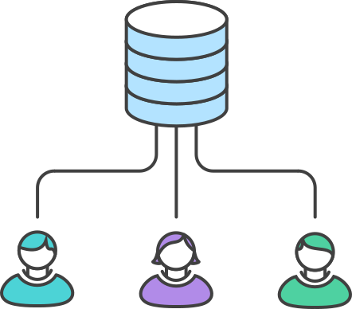
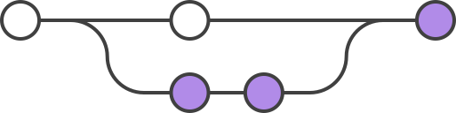
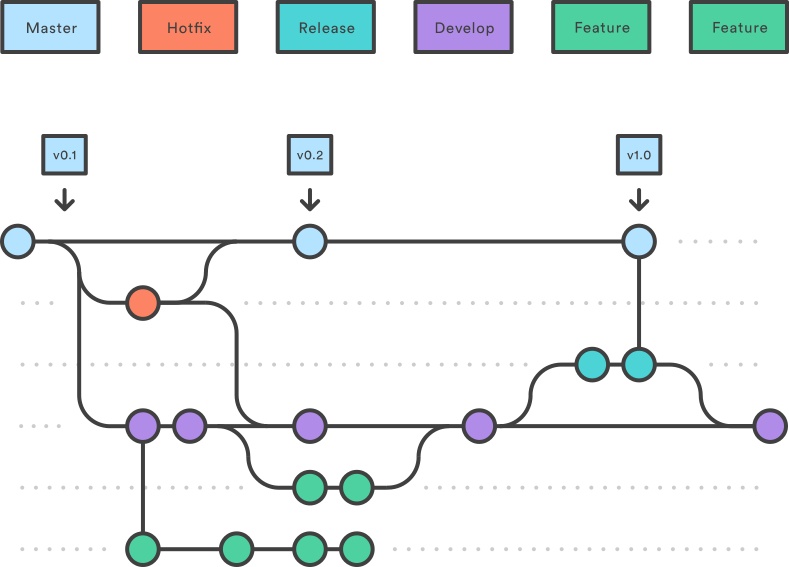
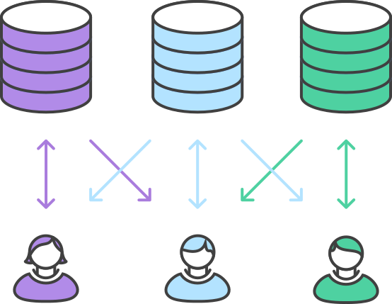
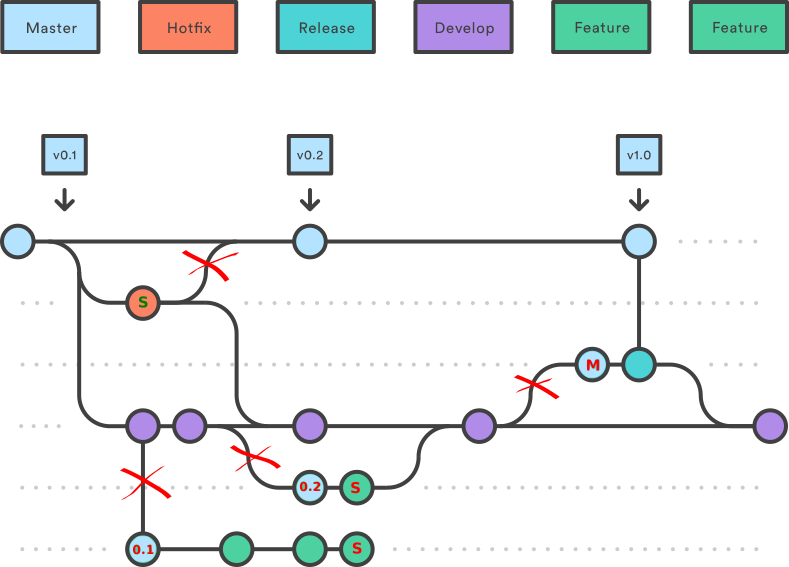

Treinamento Symfony
========================================================
author: Wagner Pinheiro
date: Novembro de 2016

Tópicos
========================================================

- PHP 
- Frameworks web
- Symfony
- Boas Práticas
- GIT (Workflows)
- hands-on: Symfony 1.4
- Case Mandic

PHP (- custo + benefícios)
========================================================

- nasceu na web para a web (Rasmus Lerdorf, 1995)
- licenças & infra (LAMP)
- linguagem interpretada
- stateless
- concorrência
- PECL, PEAR, Composer
- JIT com HHVM 

Empresas: Wikipedia, Facebook, Yahoo, Slack, Digg, ERPFlex...
CMS: Wordpress, Drupal, Joomla, MediaWiki

2013: 240 milhões de sites (39% da amostra)

PHP (Dificuldades)
========================================================

Evoluiu Personal Home Page -> Hypertext Preprocessor
- type hinting (php5)
- Scalar Type Hints (php7)
- Return Type Declarations (php7)
- inconcistências na biblioteca padrão
- passagem de parâmetro por valor (primitivas) ou referência (obj)

2013: 170k website defacements -> 53% provocado por include, require, e allow_url_fopen

Frameworks Web
========================================================

Timeline das versões estáveis

Frameworks Web
========================================================
left: 70%

Contexto
- Spring - Java (10/2002)
- Django - Python (07/2005)
- Ruby on Rails - Ruby (12/2005)
- CakePhp (04/2005)
- Symfony (10/2005) 
- Zend Framework (03/2006)
- Silex (09/2010)
- Laravel (06/2011)

***

Timeline Symfony
- v1.0 (2007)
- v1.2 (2008)
- v1.4 (2009)
- v2.0 (2011)
- v3.0 (2015)

Symfony
========================================================

- Projeto iniciado em 2004 pelo Fabio Potencier para a SensioLabs;
- Boas práticas MVC e OOP
- Alinhado com outros frameworks
- php 5.x

TO-DO: detalhar

Boas práticas OOP
========================================================

- DRY [*Don't Repeat Yourself* (DRY) or *Duplication is Evil* (DIE)]
- KISS [*Keep it simple, Stupid!*]
- SOLID (fácil de manter e estender)
- *Premature optimization is the root of all evil*
- Design Patterns (singleton, factory, proxy, D.I.)

Boas práticas OOP: SOLID
========================================================

- Single responsibility principle
<small>*“a class should have only a single responsibility (i.e. only one potential change in the software's specification should be able to affect the specification of the class)”*</small>
- Open/closed principle
<small>*“software entities … should be open for extension, but closed for modification.”*</small>
- Liskov substitution principle
<small>*“objects in a program should be replaceable with instances of their subtypes without altering the correctness of that program.”*</small>
- Interface segregation principle
<small>*“many client-specific interfaces are better than one general-purpose interface.”*</small>
- Dependency inversion principle
<small>*“one should Depend upon Abstractions. Do not depend upon concretions.”*</small>

GIT
========================================================

TO-DO

GIT: Comandos
========================================================

TO-DO

GIT: Workflows
========================================================

- centralized
- feature
- gitflow
- forking

GIT: Centralized Workflow
========================================================

GIT: Centralized Workflow (like SVN)
========================================================

<small>

1. admin: ssh user@host git init --bare /path/to/repo.git
1. joão/maria: git clone ssh://user@host/path/to/repo.git
1. maria: git status # View the state of the repo
1. maria: git add <some-file> # Stage a file
1. maria: git commit # Commit a file</some-file>
1. maria: git push origin master
1. joão: git push origin master 
1. error: failed to push some refs to '/path/to/repo.git'
1. joão: git pull --rebase origin master
1. joão: git add <some-file>
1. joão: git rebase --continue
1. joão: git rebase --abort
1. joão: git push origin master

</small>

GIT: Feature Workflow (pull request)
========================================================
left: 60%

<small>

1. maria: git checkout -b marys-feature master
1. maria: git status
1. maria: git add <some-file>
1. maria: git commit
1. maria: git push -u origin marys-feature
1. maria: solicita pull request pela gui
1. admin: aceita/rejeita o pull request 

(aceita => merge no master | rejeita => anotações & maria volta passo 2)

</small>

***

GIT: Gitflow Workflow (releases)
========================================================

GIT: Forking Workflow (Github/Gitlab)
========================================================

GIT: Forking Workflow (Github/Gitlab)
========================================================

<small>

1. na gui: fork
1. working
1. git fetch upstream
1. git checkout master
1. git merge upstream/master
1. na gui: pull request

</small>

Sintaxe PHP - Requisito Para Aula Prática (Revisão)
========================================================

- variáveis
- estruturas condicionais
- estrutura repetitivas
- UML (básico)
- OOP (básico)

Prática Symfony
========================================================

- linux
- checkout do github
- testar alguns comandos do git
- funcional x OOP x MVC
- executando o container docker para o symfony

***

- criando um novo projeto (composer)
- configuração do DB
- definindo um modelo
- criando um controller
- implementando a view

 
Symfony: Além do MVC
========================================================

- template system
- ORM (Doctrine|Propel)
- Logger
- Web Debug Toolbar
- Widgets and Validators
- Links And The Routing System
- Forms
- Emails

***

- Caching
- I18n And L10n
- Admin Generator
- Unit And Functional Testing (lime)
- plugins
- tasks (cli)
- autoload
- environments
- yaml

Infra Webmail
========================================================

Ciclo de Vida Desenvolvimento
========================================================

TO-DO: Incluir diagrama Itil + Scrum

Gitflow Alternative
========================================================

Caso de Uso: Implementações e Solução de Bugs Zeus
========================================================

- Demonstração do source do Zeus
- Troubleshooting
- Implementação do drag-n-drop
- Melhoria do suporte ao TNEF

Finalização
========================================================

- DevOps (deploy, arquitetura, docker...)

- TDD & CI (Jenkins | Jira)

- Treinamento Symfony 2.0/3.0
 - Dependency Injection pattern + Microservices
 - Packaged as Distributions
 - Everything is a Bundle in Symfony2
 - Assetic, Monolog, Twig, Imagine, PHPUnit

Referências
========================================================

<small>

- http://symfony.com/legacy/doc/jobeet?orm=Propel
- http://symfony.com/legacy/doc/gentle-introduction
- http://symfony.com/legacy/doc/more-with-symfony
- https://github.com/mraible/history-of-web-frameworks-timeline
- https://en.wikipedia.org/wiki/Comparison_of_web_frameworks
- https://slack.engineering/taking-php-seriously-cf7a60065329#.x1565p6jn
- https://www.atlassian.com/git/tutorials/comparing-workflows
- http://fabien.potencier.org
- http://martinfowler.com

</small>
